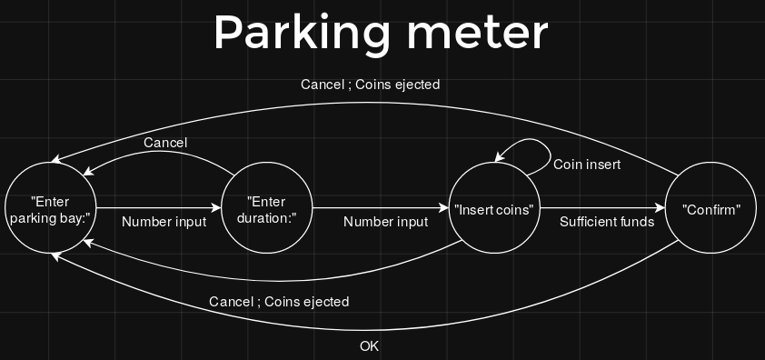

# Final Exam

## Value: 50% of course mark (exam is out of 100)

## Preamble

Please note the following before you begin the exam:

* You have been given access to this repo only for the duration of the assessment. You will lose access once the deadline passes.
* Whatever is in this repo at the deadline will be considered your submission.
* In case of technical failure, it's important that you **commit and push regularly**. You will not be assessed on the quality of your commit messages.
* Many questions are automarked. Please follow all instructions exactly and check that you have done so after you complete each exercise. Failure to do so could result in 0 for a particular exercise.
* The full 24 hours you are given is to account for any local technical issues you may have. As such, special consideration will not be awarded for issues like forgetting to commit or push changes, VLAB disconnections, accidentally overwriting work, etc.
* For written questions, ensure your answers are of the suggested length.

For all other information relating to the running of the exam, see the 'Exam info' page on the course website.

## Multiple choice (each question is 1 mark)

For this section. Put your answers to each question at the end of the corresponding line in `multiple_choice.txt`. Each question only has one answer.

### Q1

```python
def foo():
    i = 0
    while i <= 9:
        if i % 3 == 0:
            print(i*2)
        else:
            print(i*3)
        i += 1
    print("done")
```

What's the cyclomatic complexity of the above function?

* (A) 11
* (B) 10
* (C) 3
* (D) 4


### Q2

```python
def foo(n):
    yield 1
    if n < 2:
        return
    yield 2
    yield 3
```

The above code is?

* (A) A generator object and a function
* (B) Not valid python code
* (C) A function
* (D) A generator function
* (E) A generator object


### Q3

Which of the following, is **NOT** considered an agile practice in software engineering.

* (A) Requiring a complete specification before implementation
* (B) Writing tests before the implementation
* (C) Pair programming
* (D) Standups


### Q4

Here is some code before a refactor:

```python
import jwt

encoded_jwt = jwt.encode({'some': 'payload'}, 'applepineappleorange', algorithm='HS256')

print(jwt.decode(encoded_jwt, 'applepineappleorange', algorithms=['HS256']))
```

and here is some code after the refactor:

```python
import jwt

algorithm = 'HS256'

encoded_jwt = jwt.encode({'some': 'payload'}, 'applepineappleorange', algorithm=algorithm)

print(jwt.decode(encoded_jwt, 'applepineappleorange', algorithms=[algorithm]))
```

What SE principle has been used to refactor this code?

* (A) Don't Repeat Yourself
* (B) Keep it Simple Stupid
* (C) Top-down design


### Q5

Which of the following would **NOT** be used to *authenticate* users:

* (A) Checking a user's access privileges
* (B) Storing cookies on the web browser
* (C) Encoding JWT tokens
* (D) Verifying email addresses
* (E) Hashing passwords and checking them against stored hashes


### Q6

Which of the following would **NOT** be part of a system of *authorisation*:

* (A) Users with higher access levels promoting those with lower access levels
* (B) Storing user permissions in a database
* (C) Disallowing certain actions based on user access level
* (D) Hashing passwords and checking them against stored hashes


### Q7



Above is a state diagram. Which of the following statements is **true**?

* (A) You can confirm after inserting coins without sufficient funds
* (B) After entering a duration, coins **must** be inserted
* (C) After entering a parking bay number, the user **must** enter in a duration.
* (D) After coins are inserted, the customer can cancel immediately


### Q8

What distinguishes continuous delivery from continuous deployment?

* (A) Continuous deployment has more flighting levels than continuous delivery
* (B) Speed of deployment to end-users
* (C) Automatic or manual nature of trigger
* (D) Automatic or manual nature of the deployment actions


### Q9

Which of the following will the python interpreter accept as the name for the first parameter of instance methods in classes?

* (A) self
* (B) this
* (C) thing
* (D) all of the above


### Q10

Which of the following is a functional requirement?

* (A) The university website needs to be available 24 hours a day.
* (B) The analysis program must run in under a minute.
* (C) At peak times, the website has to handle 10,000 simultaneous users.
* (D) The program needs to find all viable organ donors in the database.


### Q11


Here is a state diagram. How many transitions exist in this state diagram?

* (A) 8
* (B) 4
* (C) 6
* (D) 7


### Q12

What are the 4 requirements engineering steps in order?

* (A) Elicitation, Specification, Analysis, Validation
* (B) Specification, Analysis, Validation, Elicitation
* (C) Analysis, Elicitation, Validation, Specification
* (D) Elicitation, Analysis, Specification, Validation
* (E) Analysis, Elicitation, Specification, Validation


### Q13

What is `/calendar/view` in the URL:

`http://unsw.com/calendar/view?term=t3&week=5#top`

* (A) protocol
* (B) query string
* (C) domain
* (D) path


### Q14

Your web application lets users upload images for use as profile pictures. However, after the application has been deployed for a few months, a user uploads an image, but there is insufficient disk space to store it. What error code would be returned in this instance?

* (A) 500
* (B) 200
* (C) 400
* (D) 404


### Q15

```python
messages = ["Hello", "How are you?"]

def example1():
    print(messages)

def example2():
    messages[0] = "Hi"

def example3():
    messages.append("Nice hat")

def example4():
    messages = ["Goodbye", "See you later"]
```

Which of the above functions should have `global messages` as their first line?

* (A) All of them
* (B) example2, example3 and example4
* (C) example4
* (D) example3


### Checking

You can check that your answers to the multiple choice questions are in the right format by running `python3 check_multiple_choice.py`.

**HINT:** Now would be a very good time to commit and push your changes.

## Short answer

### User stories (10 marks)

Consider this software system:

> As a consequence of people being in isolation and working from home, many businesses have goods and supplies that they no longer need (food, furniture, stationary, etc.). Similarly, many organisation and individuals are unable to get what they need due to reduced international shipping. The website covid-donate.org.au lets businesses who are trying to get rid of excess items donate them to those who may need them. The website has a frontend, built with react, that allows people looking for items to post their name and phone number along with a description of what they're looking for. Businesses can either go through these listings to find a potential receiver, or make a post as a donor containing a list of what they are hoping to donate.

Write two appropriate user stories for this system in `story1.txt` and `story2.txt`.

### Code review (10 marks)

In `dice.py` there is an implementation of a simple 1 player dice game. In this game, the player rolls 5 dice with the aim of getting the best poker-style hand (5 of a kind, Full House, Straight, Pair, etc.). After their first roll they get two chances to pick which, if any, of the dice they want to reroll.

Look at the code that implements this game and, assuming the code works as intended, review it. In `review.txt` write down 5 issues you identified. You need to include:

* The line number(s) of the issue.
* Why it's a problem
* How to fix the problem

Please ensure that:
* You only identify 5 or fewer issues. If you feel there are more than 5 issues, pick the 5 most significant.
* You do not change the code. Write all your comments in `review.txt`.
* If the same issue occurs in multiple places in the code, you only count it as one issue.

**HINT:** Now would be a very good time to commit and push your changes.

## Programming

### Dictionary Construction (3 marks)

In `dictionary.py`, complete the function `construct_dict()` according to its documentation. Some tests have been provided for you in the same file. If you are able to pass all the tests, you will get full marks (provided you're not cheating by hardcoding the test data in your solution).

### Cycles (7 marks)

In `distance.py`, complete the `longest_distance()` function according to its documentation. Some tests have been provided for you. To ensure your solution is correct, you may wish to write more. Only your implementation of the function is marked, not your tests.

### Person Class (5 marks)

In `person.py`, using properties, implement the `Person` class so that the tests pass. Any behaviour that is not apparent from the tests you're free to make your own assumptions about. There may be more than one possible interpretation of the tests. If you are able to pass all the tests, you will get full marks (provided you're not cheating by hardcoding the test data in your solution).

**HINT:** Now would be a very good time to commit and push your changes.

### Helpr (45 marks)

**NOTE:** This exercise involves implementing a complex system with various features. In addition to reading the question itself, you will need to look at all the provided code (including the given test) to form a complete idea of what is required. Do this before you start writing any of your own code.

Consider a software system called 'helpr' that allows students to queue for individual help from tutors during help sessions. At a high level, students using this system are able to:

* Place a request at the end of the queue by giving a brief description of their problem.
* See how many people there are in front of them in the queue who are also waiting for help.
* Cancel their request, if they are able to resolve the problem themselves before a tutor is available.

The tutors can then:

* See all the requests in the queue, with an indication of which requests are already being handled by another tutor.
* Select which student to help next. The expectation is that they will help the first person in the queue not already being helped, but that may not always be possible; e.g. they may lack the requisite knowledge or the student may have gone to the bathroom.
* Remove requests from the queue once the problems have been resolved.
* Reprioritise the queue, if it is toward the end of the help session. This moves the students who have received the least help ahead of those who have received more help.

More concretely:

* Once a student has a request in the queue, they can't make any further requests until that request is resolved by a tutor or they cancel it.
* Requests in the queue have a status of either "waiting", for students still waiting for help, or "receiving" for students currently receiving help.
* When students view how many people are in front of them in the queue, it does **not** include requests that are in the "receiving" state.
* Requests can only be removed from the queue when they have been resolved by a tutor or cancelled by the student.

For this exercise, you will be implementing the backend of such a system. The tasks you need to complete are below. It is suggested you do them in the order given, but you may do them out of order if you wish. You only need to consider the behaviour of the system that has been defined. If behaviour has not been defined, you may make whatever assumption you think is reasonable.

You do **NOT** need to consider authentication or authorisation in your implementation. Similarly, it does not need to use any form of synchronisation or work in a multi-threaded context.

#### Testing (10 marks)

Look at the functions and how they have been documented in `helpr.py`. Write a series of robust tests for those functions in `helpr_test.py`. Your tests should be black-box tests that make no assumption how particular functions have been implemented. You tests may be run against implementations other than your own.

#### Implementation (10 marks)

Implement the functions in `helpr.py` according to their documentation. Use your tests to increase confidence in their correctness. Your implementation will be tested with tests other than your own, so ensure your functions are consistent with the documentation given.

#### Coverage (5 marks)

Ensure your tests give 100% branch coverage for `helpr.py`. Add more tests if necessary. You will be marked only on the coverage percentage of `helpr.py` when your tests are run.

#### Linting (5 marks)

Ensure your code in `helpr.py` and `helpr_test.py` achieves a pylint score of 10/10. A `.pylintrc` file has been provided for you. You should **NOT** modify this file or use pylint pragmas (i.e. `#pylint: disable=...`) anywhere in your code. You will not be marked on the pylint score of other files in this exam.

#### Server (10 marks)

In `server.py`, implement a flask server to act as a wrapper for the functions you've written. The routes you must implement and how they work are described in the documentation for each route.

#### HTTP Tests (5 marks)

In `helpr_http_test.py` write a series of HTTP tests, using URLlib or the `requests` library. Ensure you check all the routes and cases where they cause HTTP errors. Your tests may be run against implementations other than your own, so only test behaviour which is documented in `server.py`.

**HINT:** Now would be a very good time to commit and push your changes.

### Generalised neighbours (5 marks)

**NOTE:** You may find this question more challenging than the other questions. Given that it is only worth 5% of the exam, it is strongly recommended you attempt it only after completing all other questions.

Recall the neighbours exercise from lab 9. In this exercise you will implement a more generalised version of that in `neighbours.py`. For this exercise you will get:

* 2.5 marks if you successfully implement the function.
* 5 marks if you successfully implement the function without using any explicit loops (`for` or `while`) or any form of recursion (this includes mutual recursion). You may otherwise use anything provided by the Python standard library.

You may find helper functions/generators are necessary.

While only your implementation of the function is marked, you would be well advised to write more tests than the one you've been given.

## Submission

**Make sure all the work you wish to submit has been committed and pushed to the remote repo**.

Run `git status` to ensure any files you modified have been committed and that `master` is up to date with `origin/master`.

No leniency will be granted if you fail to push your work to your remote repository.

